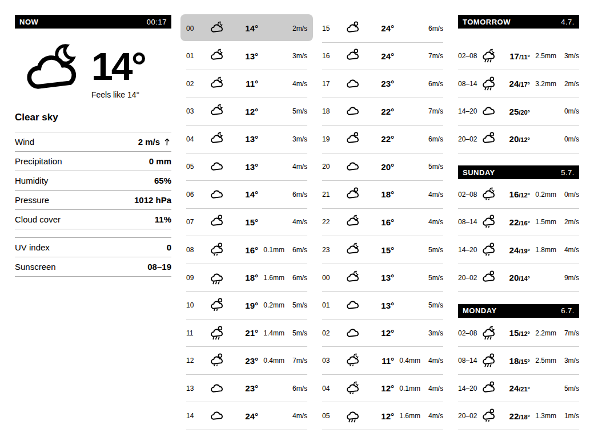
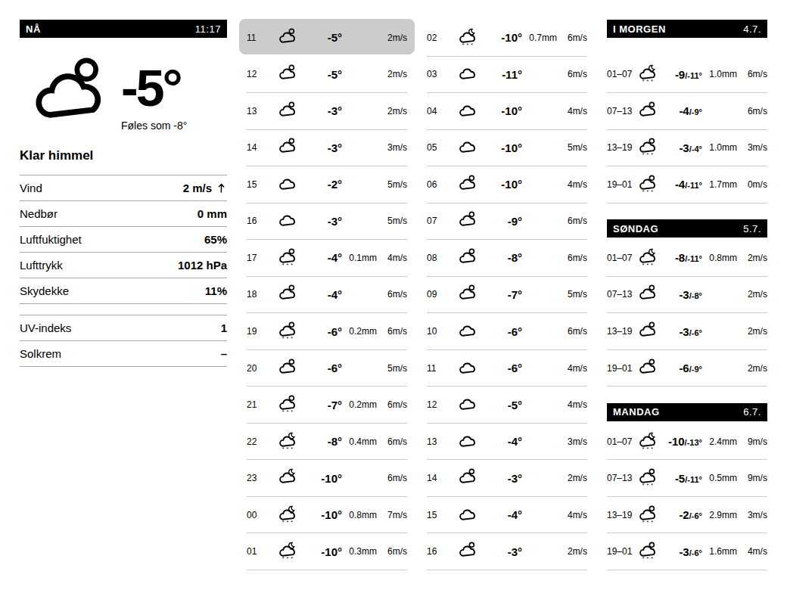

# Met.no Weather Forecast for TRMNL

A weather forecast plugin for [TRMNL](https://usetrmnl.com) e-paper screens that displays current and upcoming weather conditions using data from The Norwegian Meteorological Institute ([met.no](https://www.met.no)). Only the full-screen layout is provided, designed for the TRMNL X (1040×780); on smaller screens it shows an "only supported on TRMNL X" notice instead.

## Screenshots

Summer (English) — current conditions with UV and sunscreen window, the next 30 hours hour by hour with the current hour highlighted, and 6-hour blocks for the next three days:

Winter (Norwegian) — negative temperatures, max/min ranges in the 6-hour blocks, no sunscreen window:

*The previews are rendered with placeholder weather glyphs; on the device the plugin uses TRMNL's hosted weather icon set.*

**Features:**
- **Current Conditions Panel**: Large weather icon with temperature, "feels like" temperature (wind chill/heat index), wind speed and direction, precipitation, humidity, pressure, and cloud cover
- **UV & Sunscreen Window**: Current clear-sky UV index and the time range when UV is forecast to be 3 or higher — i.e. when sunscreen is recommended (rolls over to tomorrow's window in the evening)
- **Hour-by-hour Timeline**: The next 30 hours hour by hour with the current hour highlighted, plus 6-hour blocks with max/min temperatures for the next three days, following the API's native forecast windows
- **Configurable Location**: Set custom latitude and longitude coordinates for any location
- **Multi-language Support**: Available in English and Norwegian

## Setup

The plugin lives in `/met-no/` and works as a TRMNL [private plugin](https://usetrmnl.com):

1. In TRMNL, create a new private plugin with the **polling** strategy.
2. Set the polling URL to `https://api.met.no/weatherapi/locationforecast/2.0/complete.json?lat={{ latitude }}&lon={{ longitude }}` and add the header `user-agent=TRMNL` (see `met-no/settings.yml` for the full configuration, including the latitude, longitude, and language custom fields).
3. Copy `met-no/full.liquid` into the full layout markup and `met-no/shared.liquid` into the shared markup.
4. Set your latitude, longitude, and language in the plugin settings.

Alternatively, use [trmnlp](https://github.com/usetrmnl/trmnlp) with the `met-no` directory to preview and push the plugin.

## Data

Weather data from [MET Norway](https://www.met.no)'s [Locationforecast 2.0](https://api.met.no/weatherapi/locationforecast/2.0/documentation) API, licensed under [NLOD 2.0](https://data.norge.no/nlod/en/2.0) and [CC BY 4.0](https://creativecommons.org/licenses/by/4.0/).

## Credits

This project is based on [argoroots/trmnl](https://github.com/argoroots/trmnl) by [Argo Roots](https://github.com/argoroots), whose met.no plugin provided the original layouts, weather symbol mapping, and translations. The TRMNL X full-screen redesign, UV/sunscreen section, and aggregation logic were built on top of that foundation. The original work is MIT licensed, and this repository retains its license.
